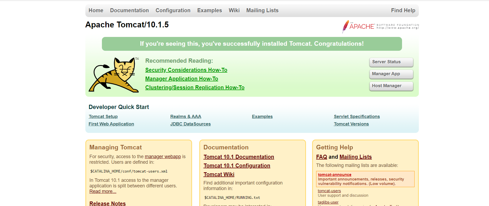
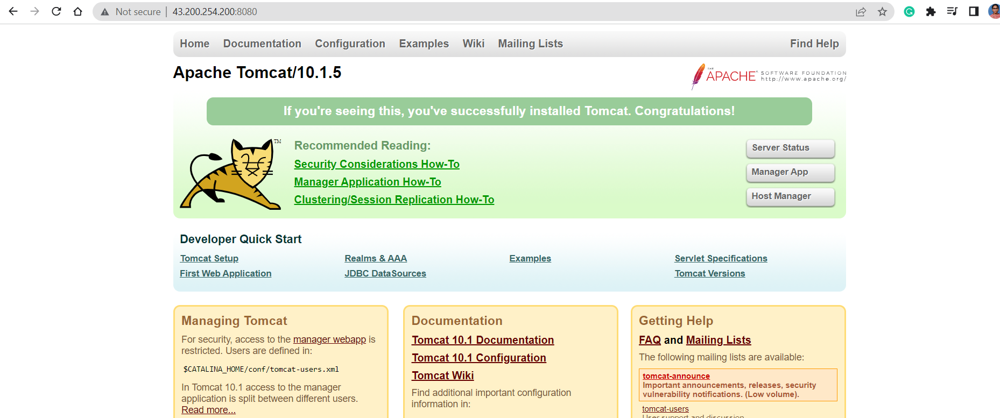

# Tomcat installation on ubuntu 22.04


* For manual steps [referhere](https://linuxize.com/post/how-to-install-tomcat-10-on-ubuntu-22-04/)
  
Manual Steps:
-------------
```
sudo apt update
sudo apt install openjdk-11-jdk -y
java -version
sudo useradd -m -U -d /opt/tomcat -s /bin/false tomcat
VERSION=10.1.5
wget https://www-eu.apache.org/dist/tomcat/tomcat-10/v${VERSION}/bin/apache-tomcat-${VERSION}.tar.gz -P /tmp
sudo tar -xf /tmp/apache-tomcat-${VERSION}.tar.gz -C /opt/tomcat/
sudo ln -s /opt/tomcat/apache-tomcat-${VERSION} /opt/tomcat/latest
sudo chown -R tomcat: /opt/tomcat
sudo sh -c 'chmod +x /opt/tomcat/latest/bin/*.sh'
sudo nano /etc/systemd/system/tomcat.service
sudo systemctl daemon-reload
sudo systemctl enable --now tomcat
sudo systemctl status tomcat
``` 
* After doing those manual steps you get a tomcat page by entering <publicip>:8080
 
 
Ansible-playbook for above commands:
------------------------------------
[referhere](https://github.com/tejaswini1811/ansiblejan/blob/main/Ansible/tomcat/tomcat.yml) for playbook.
* To ensure syntax is correct <ansible-playbook -i hosts --syntax-check tomcat.yml> 
* To excute the playbook <ansible-playbook -i hosts tomcat.yml>
* After that you get check the status in node and check the tomcat page.
  
Configuring Tomcat Web Management Interface
-------------------------------------------
* [referhere](https://linuxize.com/post/how-to-install-tomcat-10-on-ubuntu-22-04/#configuring-tomcat-web-management-interface) for manual steps of configuring tomcat web management.
