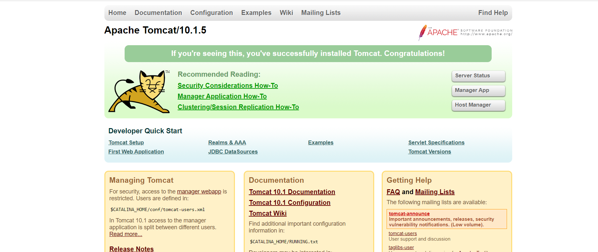
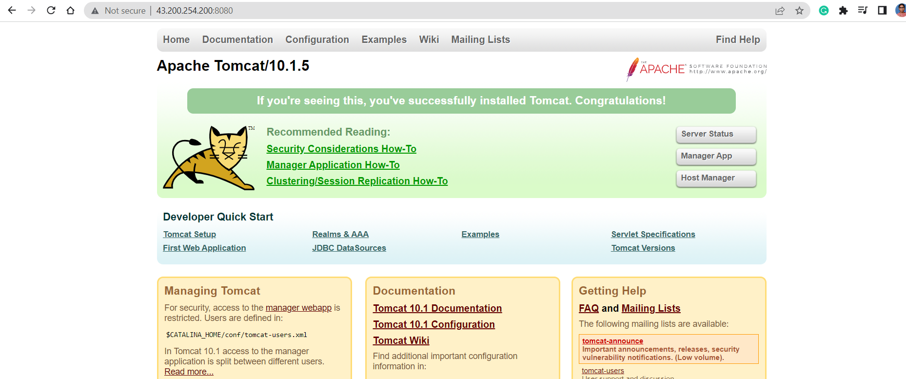
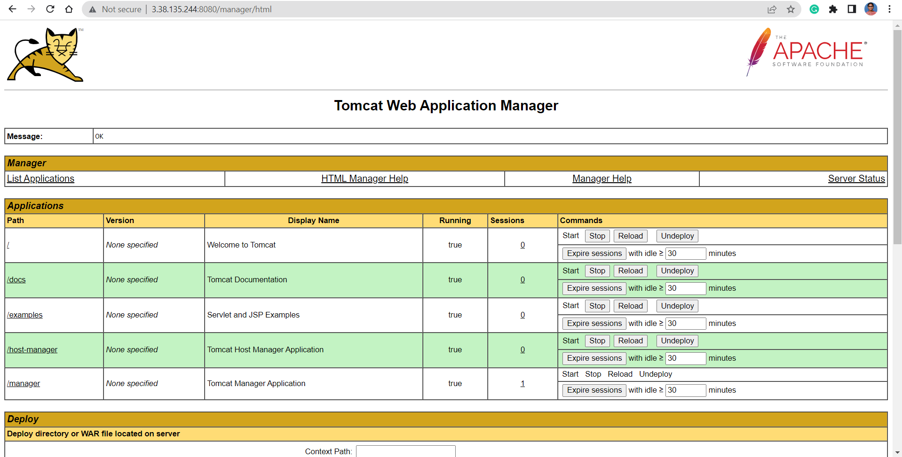
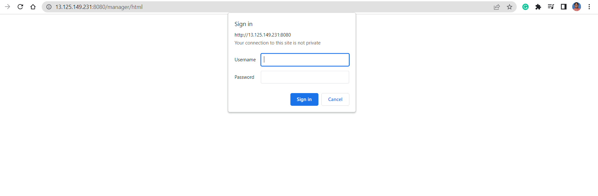
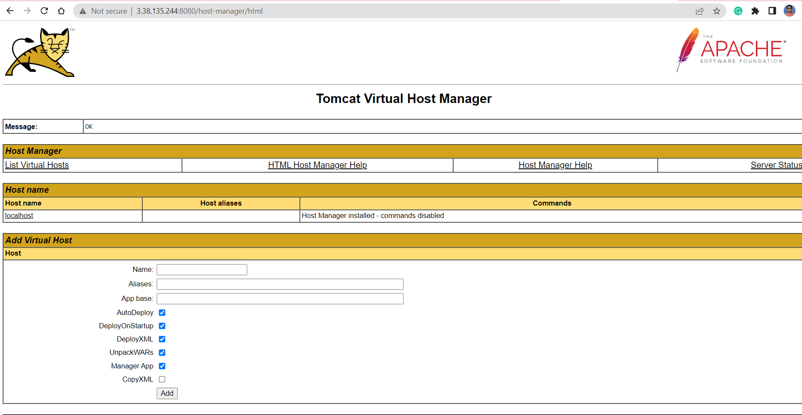
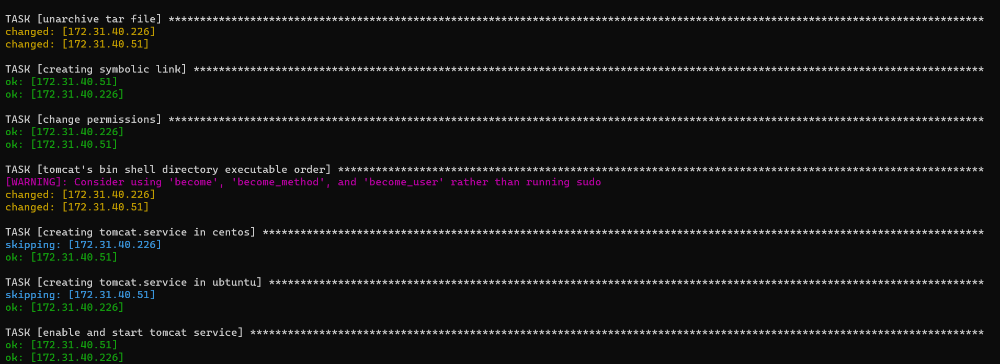
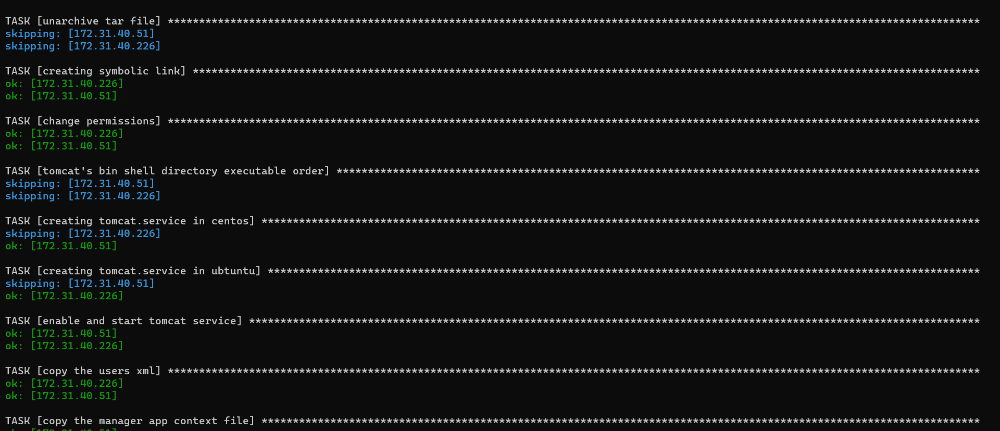

# Tomcat installation on ubuntu 22.04


* For manual steps [referhere](https://linuxize.com/post/how-to-install-tomcat-10-on-ubuntu-22-04/)
  
Manual Steps:
-------------
  ```
  sudo apt update
  sudo apt install openjdk-11-jdk -y
  java -version
  sudo useradd -m -U -d /opt/tomcat -s /bin/false tomcat
  VERSION=10.1.5
  wget https://www-eu.apache.org/dist/tomcat/tomcat-10/v${VERSION}/bin/apache-tomcat-${VERSION}.tar.gz -P /tmp
  sudo tar -xf /tmp/apache-tomcat-${VERSION}.tar.gz -C /opt/tomcat/
  sudo ln -s /opt/tomcat/apache-tomcat-${VERSION} /opt/tomcat/latest
  sudo chown -R tomcat: /opt/tomcat
  sudo sh -c 'chmod +x /opt/tomcat/latest/bin/*.sh'
  sudo nano /etc/systemd/system/tomcat.service
  sudo systemctl daemon-reload
  sudo systemctl enable --now tomcat
  sudo systemctl status tomcat
  ``` 
* After doing those manual steps you get a tomcat page by entering <publicip>:8080
 
 
Ansible-playbook for above commands:
------------------------------------
[referhere](https://github.com/tejaswini1811/ansiblejan/blob/main/Ansible/tomcat/tomcat.yml) for playbook.
* To ensure syntax is correct `ansible-playbook -i hosts --syntax-check tomcat.yml`
* To excute the playbook `ansible-playbook -i hosts tomcat.yml`
* After that you get check the status in node and check the tomcat page.

Configuring Tomcat Web Management Interface
-------------------------------------------
* [referhere](https://linuxize.com/post/how-to-install-tomcat-10-on-ubuntu-22-04/#configuring-tomcat-web-management-interface) for manual steps of configuring tomcat web management.
* After doing those steps we access manager app and host manager buttons


* For ansible-playbook.
```yaml
---
- name: tomcat on ubuntu
  hosts: all
  become: yes
  vars:
    java_version: openjdk-11-jdk
    user_home: /opt/tomcat
    user_shell: /bin/false
    tomcat_version: "10.1.5"
    tomcat_major_version: "10"
    user_name: tomcat
    group_name: tomcat
    tomcat_service_name: tomcat.service
  tasks:
    - name: installing java
      ansible.builtin.apt:
        name: "{{ java_version }}"
        update_cache: yes
        state: present
    - name: creating a system user
      ansible.builtin.user:
        name: "{{ user_name }}"
        create_home: true
        home: "{{ user_home }}"
        shell: "{{ user_shell }}"
        state: present
    - name: creating tomcat group
      ansible.builtin.group:
        name: "{{ group_name }}"
        state: present
    - name: downloading tomcat
      ansible.builtin.get_url:
        url: "https://www-eu.apache.org/dist/tomcat/tomcat-{{ tomcat_major_version }}/v{{ tomcat_version }}/bin/apache-tomcat-{{ tomcat_version }}.tar.gz" 
        dest: /tmp/
    - name: unarchive tar file
      ansible.builtin.unarchive:
        src: "/tmp/apache-tomcat-{{tomcat_version}}.tar.gz"
        dest: "{{ user_home }}"
        mode: '777'
        owner: "{{ user_name }}"
        group: "{{ group_name }}"
        remote_src: yes
    - name: creating symbolic link
      ansible.builtin.file: 
        src: "{{ user_home }}/apache-tomcat-{{tomcat_version}}"
        dest: "{{ user_home }}/latest"
        owner: "{{ user_name }}"
        group: "{{ group_name }}"
        state: link
        mode: '777'
    - name: tomcat's bin shell directory executable order
      ansible.builtin.command: "sudo  sh -c 'chmod +x {{ user_home }}/latest/bin/*.sh'"
    - name: creating tomcat.service
      ansible.builtin.copy:
        src: "{{ tomcat_service_name }}"
        dest: "/etc/systemd/system/{{ tomcat_service_name }}"
        owner: "{{ user_name }}"
        group: "{{ group_name }}"
        mode: '777'
    - name: enable and start tomcat service
      ansible.builtin.systemd: 
        name: "{{ tomcat_service_name }}"
        daemon_reload: yes
        enabled: yes
        state: started
    - name: copying tomcat-users.xml
      ansible.builtin.copy:
        src: tomcat-users.xml
        dest: "{{ user_home }}/latest/conf/tomcat-users.xml"
        owner: "{{ user_name }}"
        group: "{{ group_name }}"
        mode: '777'
    - name: copying context.xml
      ansible.builtin.copy:
        src: context.xml
        dest: "{{ user_home }}/latest/webapps/manager/META-INF/context.xml"
        owner: "{{ user_name }}"
        group: "{{ group_name }}"
        mode: '777'
    - name: copying hostmanager-context.xml
      ansible.builtin.copy:
        src: hostmanager-context.xml
        dest: "{{ user_home }}/latest/webapps/host-manager/META-INF/context.xml"
        owner: "{{ user_name }}"
        group: "{{ group_name }}"
        mode: '777'
    - name: restart tomcat service
      ansible.builtin.systemd:
        name: "{{ tomcat_service_name }}"
        state: restarted
```
* For tomacat- userxml. [Referhere]()
* After applying playbook we can access tomcat web.



$Variable:$
* Added variables for ansible-playbook [referhere](https://github.com/tejaswini1811/ansiblejan/tree/main/tomcat/tomcat-vars).

* One playbook for both centos and ubuntu machine
```yaml
---
- name: tomcat on ubuntu and centos
  hosts: appservers
  become: yes
  tasks:
    - name: installing java
      ansible.builtin.package:
        name: "{{ java_version }}"
        state: present
    - name: creating a system user
      ansible.builtin.user:
        name: "{{ user_name }}"
        create_home: true
        home: "{{ user_home }}"
        shell: "{{ user_shell }}"
        state: present
    - name: creating tomcat group
      ansible.builtin.group:
        name: "{{ group_name }}"
        state: present
    - name: downloading tomcat
      ansible.builtin.get_url:
        url: "https://www-eu.apache.org/dist/tomcat/tomcat-{{ tomcat_major_version }}/v{{ tomcat_version }}/bin/apache-tomcat-{{ tomcat_version }}.tar.gz" 
        dest: /tmp/
    - name: unarchive tar file
      ansible.builtin.unarchive:
        src: "/tmp/apache-tomcat-{{tomcat_version}}.tar.gz"
        dest: "{{ user_home }}"
        owner: "{{ user_name }}"
        group: "{{ group_name }}"
        remote_src: yes
    - name: creating symbolic link
      ansible.builtin.file: 
        src: "{{ user_home }}/apache-tomcat-{{tomcat_version}}"
        dest: "{{ user_home }}/latest"
        owner: "{{ user_name }}"
        group: "{{ group_name }}"
        state: link
    - name: change permissions
      ansible.builtin.file:
        dest: "{{ user_home }}"
        recurse: true
        owner: "{{ user_name }}"
        group: "{{ group_name }}"
        state: directory
    - name: tomcat's bin shell directory executable order
      ansible.builtin.command: "sudo  sh -c 'chmod +x {{ user_home }}/latest/bin/*.sh'"
    - name: creating tomcat.service in centos
      ansible.builtin.copy:
        src: centos-tomcat.service
        dest: "/etc/systemd/system/{{ tomcat_service_name }}"
        owner: "{{ user_name }}"
        group: "{{ group_name }}"
      when: ansible_facts['distribution'] == "CentOS"
    - name: creating tomcat.service in ubtuntu
      ansible.builtin.copy:
        src: ubuntu-tomcat.service
        dest: "/etc/systemd/system/{{ tomcat_service_name }}"
        owner: "{{ user_name }}"
        group: "{{ group_name }}"
      when: ansible_facts['distribution'] == "Ubuntu"
    - name: enable and start tomcat service
      ansible.builtin.systemd: 
        name: "{{ tomcat_service_name }}"
        daemon_reload: yes
        enabled: yes
        state: started
    - name: copy the users xml
      ansible.builtin.copy:
        src: tomcat-users.xml
        dest: "{{ user_home }}/latest/conf/tomcat-users.xml"
        owner: "{{ user_name }}"
        group: "{{ group_name }}"
    - name: copy the manager app context file
      ansible.builtin.copy:
        src: context.xml
        dest: "{{ user_home }}/latest/webapps/manager/META-INF/context.xml"
        owner: "{{ user_name }}"
        group: "{{ group_name }}"
    - name: copy the host manager app context file
      ansible.builtin.copy:
        src: hostmanager-context.xml
        dest: "{{ user_home }}/latest/webapps/host-manager/META-INF/context.xml"
        owner: "{{ user_name }}"
        group: "{{ group_name }}"
    - name: restart tomcat
      ansible.builtin.systemd:
        name: "{{ tomcat_service_name }}"
        state: restarted
```
$Stat$ $Module:$ 
* We need to skip certain steps to execute again because it was done in first time.

* By using ansible.builtin.stat module we can do that.
* [Referhere](https://docs.ansible.com/ansible/latest/collections/ansible/builtin/stat_module.html#examples) for stat module.   
```yaml
---
- name: tomcat on ubuntu and centos
  hosts: appservers
  become: yes
  tasks:
    - name: installing java
      ansible.builtin.package:
        name: "{{ java_version }}"
        state: present
    - name: creating a system user
      ansible.builtin.user:
        name: "{{ user_name }}"
        create_home: true
        home: "{{ user_home }}"
        shell: "{{ user_shell }}"
        state: present
    - name: creating tomcat group
      ansible.builtin.group:
        name: "{{ group_name }}"
        state: present
    - name: downloading tomcat
      ansible.builtin.get_url:
        url: "https://www-eu.apache.org/dist/tomcat/tomcat-{{ tomcat_major_version }}/v{{ tomcat_version }}/bin/apache-tomcat-{{ tomcat_version }}.tar.gz" 
        dest: /tmp/
    - name: get tomcat stats
      ansible.builtin.stat:
        path: "{{ user_home }}/latest/bin/startup.sh"
      register: tomcat_startup
    - name: unarchive tar file
      ansible.builtin.unarchive:
        src: "/tmp/apache-tomcat-{{tomcat_version}}.tar.gz"
        dest: "{{ user_home }}"
        owner: "{{ user_name }}"
        group: "{{ group_name }}"
        remote_src: yes
      when: not tomcat_startup.stat.exists
    - name: creating symbolic link
      ansible.builtin.file: 
        src: "{{ user_home }}/apache-tomcat-{{tomcat_version}}"
        dest: "{{ user_home }}/latest"
        owner: "{{ user_name }}"
        group: "{{ group_name }}"
        state: link
    - name: change permissions
      ansible.builtin.file:
        dest: "{{ user_home }}"
        recurse: true
        owner: "{{ user_name }}"
        group: "{{ group_name }}"
        state: directory
    - name: tomcat's bin shell directory executable order
      ansible.builtin.command: "sudo  sh -c 'chmod +x {{ user_home }}/latest/bin/*.sh'"
      when: not tomcat_startup.stat.exists
    - name: creating tomcat.service in centos
      ansible.builtin.copy:
        src: centos-tomcat.service
        dest: "/etc/systemd/system/{{ tomcat_service_name }}"
        owner: "{{ user_name }}"
        group: "{{ group_name }}"
      when: ansible_facts['distribution'] == "CentOS"
    - name: creating tomcat.service in ubtuntu
      ansible.builtin.copy:
        src: ubuntu-tomcat.service
        dest: "/etc/systemd/system/{{ tomcat_service_name }}"
        owner: "{{ user_name }}"
        group: "{{ group_name }}"
      when: ansible_facts['distribution'] == "Ubuntu"
    - name: enable and start tomcat service
      ansible.builtin.systemd: 
        name: "{{ tomcat_service_name }}"
        daemon_reload: yes
        enabled: yes
        state: started
    - name: copy the users xml
      ansible.builtin.copy:
        src: tomcat-users.xml
        dest: "{{ user_home }}/latest/conf/tomcat-users.xml"
        owner: "{{ user_name }}"
        group: "{{ group_name }}"
    - name: copy the manager app context file
      ansible.builtin.copy:
        src: context.xml
        dest: "{{ user_home }}/latest/webapps/manager/META-INF/context.xml"
        owner: "{{ user_name }}"
        group: "{{ group_name }}"
    - name: copy the host manager app context file
      ansible.builtin.copy:
        src: hostmanager-context.xml
        dest: "{{ user_home }}/latest/webapps/host-manager/META-INF/context.xml"
        owner: "{{ user_name }}"
        group: "{{ group_name }}"
    - name: restart tomcat
      ansible.builtin.systemd:
        name: "{{ tomcat_service_name }}"
        state: restarted
```

  $Handlers:$
* We can improve our playbook further by using handlers.
* [Referhere](https://docs.ansible.com/ansible/latest/playbook_guide/playbooks_handlers.html#handlers) for how to use handlers.
* Sometimes you want a task to run only when a change is made on a machine. For example, you may want to restart a service if a task updates the configuration of that service, but not if the configuration is unchanged. Ansible uses handlers to address this use case. Handlers are tasks that only run when notified.
  
 $Loops:$ [Referhere](https://docs.ansible.com/ansible/latest/playbook_guide/playbooks_loops.html) for reference how to use loops in playbook.
* Ansible offers the loop, `with_<lookup>`, and until keywords to execute a task multiple times. Examples of commonly-used loops include changing ownership on several files and/or directories with the file module, creating multiple users with the user module, and repeating a polling step until a certain result is reached.
* It's like for loop in ansible.
* To do same task multiple times we use loops.
* In tomcat context.xml file content is same in manager and host manager so instead of using two different files to copy to different paths we can use same context.xml tp different paths. 
### Ansible-Playbook using handlers and loops:
```yaml
---
- name: tomcat on ubuntu and centos
  hosts: appservers
  become: yes
  tasks:
    - name: installing java
      ansible.builtin.package:
        name: "{{ java_version }}"
        state: present
    - name: creating a system user
      ansible.builtin.user:
        name: "{{ user_name }}"
        create_home: true
        home: "{{ user_home }}"
        shell: "{{ user_shell }}"
        state: present
    - name: creating tomcat group
      ansible.builtin.group:
        name: "{{ group_name }}"
        state: present
    - name: downloading tomcat
      ansible.builtin.get_url:
        url: "https://www-eu.apache.org/dist/tomcat/tomcat-{{ tomcat_major_version }}/v{{ tomcat_version }}/bin/apache-tomcat-{{ tomcat_version }}.tar.gz" 
        dest: /tmp/
    - name: get tomcat stats
      ansible.builtin.stat:
        path: "{{ user_home }}/latest/bin/startup.sh"
      register: tomcat_startup
    - name: unarchive tar file
      ansible.builtin.unarchive:
        src: "/tmp/apache-tomcat-{{tomcat_version}}.tar.gz"
        dest: "{{ user_home }}"
        owner: "{{ user_name }}"
        group: "{{ group_name }}"
        remote_src: yes
      when: not tomcat_startup.stat.exists
    - name: creating symbolic link
      ansible.builtin.file: 
        src: "{{ user_home }}/apache-tomcat-{{tomcat_version}}"
        dest: "{{ user_home }}/latest"
        owner: "{{ user_name }}"
        group: "{{ group_name }}"
        state: link
      notify:
        - change permissions
        - tomcat's bin shell directory executable order
    - name: creating tomcat.service in centos
      ansible.builtin.copy:
        src: centos-tomcat.service
        dest: "/etc/systemd/system/{{ tomcat_service_name }}"
        owner: "{{ user_name }}"
        group: "{{ group_name }}"
      when: ansible_facts['distribution'] == "CentOS"
    - name: creating tomcat.service in ubtuntu
      ansible.builtin.copy:
        src: ubuntu-tomcat.service
        dest: "/etc/systemd/system/{{ tomcat_service_name }}"
        owner: "{{ user_name }}"
        group: "{{ group_name }}"
      when: ansible_facts['distribution'] == "Ubuntu"
      notify:
        - enable and start tomcat service
    - name: copy the users xml
      ansible.builtin.copy:
        src: tomcat-users.xml
        dest: "{{ user_home }}/latest/conf/tomcat-users.xml"
        owner: "{{ user_name }}"
        group: "{{ group_name }}"
      notify:
        - restart tomcat 
    - name: copy the manager app and host managerapp context file
      ansible.builtin.copy:
        src: context.xml
        dest: "{{ item }}"
        owner: "{{ user_name }}"
        group: "{{ group_name }}"
      loop:
        - "{{ user_home }}/latest/webapps/manager/META-INF/context.xml"
        - "{{ user_home }}/latest/webapps/host-manager/META-INF/context.xml"
      notify:
        - restart tomcat
    - name: ensure tomcat service is running
      ansible.builtin.systemd:
        name: "{{ tomcat_service_name }}"
        state: started
  handlers: 
    - name: change permissions
      ansible.builtin.file:
        dest: "{{ user_home }}"
        recurse: true
        owner: "{{ user_name }}"
        group: "{{ group_name }}"
        state: directory
    - name: tomcat's bin shell directory executable order
      ansible.builtin.command: "sudo  sh -c 'chmod +x {{ user_home }}/latest/bin/*.sh'"
    - name: enable and start tomcat service
      ansible.builtin.systemd: 
        name: "{{ tomcat_service_name }}"
        daemon_reload: yes
        enabled: yes
        state: started 
    - name: restart tomcat
      ansible.builtin.systemd:
        name: "{{ tomcat_service_name }}"
        state: restarted
```
* We can write our inventory [hosts] in two formats.
     1. ini
     2. yaml
1. ### $ini:$ 
   * example of tomcat.
   ```ini
   [appservers]
   172.31.40.51 java_version=java-11-openjdk-devel
   172.31.40.226 java_version=openjdk-11-jdk

   [appservers:vars]
    user_home=/opt/tomcat
    user_shell=/bin/false
    tomcat_version= "10.1.5"
    tomcat_major_version= "10"
    user_name=tomcat
    group_name= tomcat
    tomcat_service_name= tomcat.service
   ```
2. ### $yaml:$ 
   * example of tomcat.
   ```yaml
   ---
   all:
     children: 
       appservers:
         hosts:
           172.31.40.51: 
             java_version: java-11-openjdk-devel
           172.31.40.226:
             java_version: openjdk-11-jdk
         vars: 
           user_home: /opt/tomcat
           user_shell: /bin/false
           tomcat_version: "10.1.5"
           tomcat_major_version: "10"
           user_name: tomcat
           group_name: tomcat
           tomcat_service_name: tomcat.service
   ```
* We can further seperate variables into `group_vars` and `host_vars`. 
* In `group_vars` we create a file with the name of hosts and declare the group variables.
* Same as `group_vars` in `host_vars` we create a individual files with hosts ip addresses and declare hosts individual variables.
### Template Module:
* Ansible uses jinja2 template 
* jinja2 is used in python.
* In ansible jinja2 can be used in files.
* By using template module in ansible we can provide variables in files by providing `.j2` extention. Example `tomcat-users.xml.j2` . For more dtails about template module [Refer Here](https://docs.ansible.com/ansible/latest/collections/ansible/builtin/template_module.html).
### Find Module:
* Find module is used to find files with extentions.
* [Refer Here](https://docs.ansible.com/ansible/latest/collections/ansible/builtin/find_module.html) for find module usage.